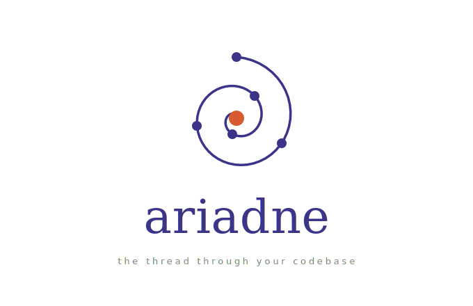

# ariadne

<p align="center">
  
</p>

A graph-based semantic system for code, documents, and diagrams. Written in Rust, end-to-end.

> Ariadne gave Theseus the thread that let him navigate the labyrinth. This is that thread for your codebase.

Ariadne builds a typed property graph of a project and exposes agent-friendly reasoning operations for search, review, impact analysis, traversal, graph visualisation, continuous indexing, and MCP integration.

## Why Ariadne

Ariadne is designed for AI coding agents that need compact, high-signal context before reading files.

- **One external tool, many internal primitives.** Agents call `ariadne tool <operation>` or connect to the stdio MCP server, which exposes a single `ariadne` tool backed by many composable operations.
- **Graph-first review context.** `detect-changes`, `review-context`, `impact`, and `traverse` produce bounded context for code review and debugging, including hunk-to-symbol diff mapping.
- **Incremental by default.** `update`, `watch`, git hooks, and daemon mode keep the graph fresh after every commit.
- **Typed, weighted reasoning.** Nodes and edges carry kinds and confidence; paths, search, PageRank, communities, and impact ranking use those signals.
- **Hybrid + semantic search.** SQLite FTS5 with a BM25-ranked, unicode61 tokeniser (underscore-aware), blended with in-memory fuzzy/topology scoring and optional local embeddings.
- **Execution flows.** Entry-point detection and forward-BFS flow tracing, materialised as `Flow` nodes ranked by criticality. Cap trimming preserves the most central nodes rather than cutting by BFS order.
- **Counterfactual reachability.** `counterfactual` drops edges and reruns BFS to answer "what breaks if I remove this dependency?" with graph-level reachability math.
- **Interactive TUI.** Three-tab terminal UI (Search / Flows / Browse) with live hybrid search, signal-aware search details, direct test coverage hints, callers/callees/flows panels, and cross-tab node navigation.
- **Local-first.** SQLite storage, tree-sitter extraction, and a self-contained D3 explorer. No external services required.

## What It Can Do Today

Ariadne is already useful as a local codebase map, an agent context server, and a review assistant.

| Area | Features |
|---|---|
| Extraction | Rust, Python, TypeScript (TS/TSX), JavaScript (JS/JSX/MJS/CJS), C/C++; Markdown sections and symbol mentions; SVG diagram text/concept extraction; file, symbol, import, call, inheritance, mention, flow, and test edges |
| Search | SQLite FTS5, BM25, unicode-aware tokenisation, fuzzy identifier matching, topology signals, and optional local semantic embeddings |
| Review | Git diff analysis, hunk-to-symbol mapping, risk scoring, suggested review questions, token-budgeted context, affected flows, and test coverage gaps |
| Graph reasoning | Weighted paths, callers/callees, impact ranking, traversal, PageRank, personalized PageRank, communities, bridge nodes, k-core, cycles, articulation points, surprises, architecture summaries, and counterfactual reachability |
| History | Incremental updates, file hashes, active/archive rows, temporal `valid_from` / `valid_to` windows, and graph diff between git refs |
| Automation | Event-driven watch mode (inotify/FSEvents, polling fallback), daemon-managed repositories, git hooks, and editor config installers for Claude Code, Cursor, VS Code, and Codex |
| Extensibility | TOML-based custom language support (`.ariadne/languages.toml`), session-tracked hints system that suggests next-step operations after tool calls |
| Dedup | Multi-pass pipeline (normalization → entropy gate → MinHash/LSH → Jaro-Winkler) to merge semantically equivalent concept/document/diagram nodes |

## How It Works

1. **Walk the workspace.** `build`, `update`, `watch`, hooks, or daemon mode scan supported files while respecting `.gitignore`, `.ariadneignore`, and common generated directories.
2. **Extract typed nodes and edges.** Tree-sitter passes create files, functions, methods, classes, traits, types, modules, imports, call edges, inheritance, test markers, Markdown sections, and SVG concepts.
3. **Resolve and enrich.** Ariadne resolves placeholder calls in four tiers — globally unique names, file-local definitions, path-qualified call scopes, and import-scoped matching (the caller's file imports the candidate's module) — removes redundant placeholders after resolution, derives `TestedBy` edges from test calls, and materialises execution flows from entry points.
4. **Persist locally.** The graph is saved to SQLite with JSON properties, FTS5 search rows, optional embedding vectors, file hashes, and temporal validity columns.
5. **Answer bounded questions.** Query commands load the graph and return compact, ranked context instead of asking an agent to read the whole tree.

## Status

| Component | State |
|---|---|
| AST pass: Rust | working — traits, methods, scoped impl/module names |
| AST pass: Python | working — scoped classes, functions, methods |
| AST pass: TypeScript | working — classes, interfaces, types, enums, functions, methods, imports |
| AST pass: JavaScript | working — .js/.mjs/.cjs via TS grammar, .jsx via TSX grammar |
| AST pass: C/C++ | working — via tree-sitter-cpp |
| Markdown concept extractor | minimal |
| LaTeX concept extractor | stub |
| SVG diagram extractor | working |
| SQLite persistence | working |
| FTS5 full-text search | working — BM25, unicode61+underscore tokeniser, blended ranking |
| Optional embeddings | working — local `ariadne-hash-v2` semantic search boost |
| Incremental updates | working — file-hash based |
| Git auto-update hooks | working |
| Watch / daemon mode | working — OS file events with debounce, polling fallback |
| Hybrid / fuzzy search | working |
| Weighted top-k paths | working |
| Personalized PageRank | working |
| Louvain / Leiden / Infomap communities | working |
| Impact analysis | working |
| Review / change analysis | working — hunk-to-symbol diff mapping |
| Test awareness | working — `TestedBy` edges and missing-test reporting |
| True temporal diff queries | working — `valid_from` / `valid_to` windows |
| First-class graph diff | working — active + archived store-backed history |
| Execution flows | working — criticality-ranked, relevance-trimmed cap |
| Interactive TUI | working — Search / Flows / Browse, ratatui, signal/test detail |
| Agent one-tool interface | working |
| Stdio MCP server | working |
| Editor MCP installers | working — Claude Code, Cursor, VS Code, Codex |
| D3 graph explorer | working |
| Performance guardrails | working — response budgets, pagination, graph summaries |
| Motifs / counterfactuals | working — VF2 subgraph isomorphism |
| Knowledge gaps | working — isolated nodes, untested hotspots, thin communities, single-file communities |
| Hub detection | working — highest-degree nodes (complements bridge nodes) |
| GraphML export | working — Gephi, yEd, Cytoscape compatible |
| Dedup | working — normalization → entropy → MinHash/LSH → Jaro-Winkler |
| Custom language support | working — TOML config for adding languages via `.ariadne/languages.toml` |
| Hints system | working — session-tracked next-step suggestions after tool calls |

## Quick Start

```bash
cargo build --release
./target/release/ariadne --db ariadne.db build .
./target/release/ariadne --db ariadne.db status
./target/release/ariadne --db ariadne.db rebuild-fts
./target/release/ariadne --db ariadne.db embed --model ariadne-hash-v2
```

Supported inputs today:

```text
Rust       .rs
Python     .py
TypeScript .ts .tsx
JavaScript .js .jsx .mjs .cjs
C / C++    .c .cc .cpp .cxx .h .hh .hpp .hxx
Docs       .md .markdown (.tex stub)
Diagrams   .svg
```

Add custom languages with `.ariadne/languages.toml` — see `extract/ast/languages.toml` for the schema.

Launch the interactive terminal UI:

```bash
./target/release/ariadne --db ariadne.db tui
```

Launch the D3 graph explorer:

```bash
./target/release/ariadne --db ariadne.db serve --host 127.0.0.1 --port 8787
# open http://127.0.0.1:8787
```

Keep the graph fresh:

```bash
./target/release/ariadne --db ariadne.db update .
./target/release/ariadne --db ariadne.db watch .
./target/release/ariadne --db ariadne.db install --repo . --agents --mcp
```

`install --repo .` writes git hooks for `post-commit`, `post-merge`, and `post-checkout`. Post-commit and checkout hooks refresh the graph after the commit SHA is settled. The hooks are informational and do not block the commit.

Use the graph for review:

```bash
./target/release/ariadne --db ariadne.db detect-changes --base HEAD~1 --brief
./target/release/ariadne --db ariadne.db review-context --base HEAD~1 --token-budget 1600
./target/release/ariadne --db ariadne.db suggested-questions --base HEAD~1
```

## Core Concepts

| Concept | Meaning |
|---|---|
| Node | A typed thing Ariadne can reason about: file, function, method, class, trait, type, module, document, section, diagram concept, or execution flow |
| Edge | A typed relationship: defines, imports, calls, inherits, mentions, member-of, or tested-by |
| Confidence | Extracted, inferred, or ambiguous; queries can prefer structural edges without throwing away uncertain evidence |
| Flow | A synthetic node representing a forward call trace from an entry point, ranked by criticality |
| Temporal row | A stored node or edge with `valid_from` and `valid_to`, so diffs can compare graph states across refs |
| Guardrails | Response limits, pagination, detail levels, and graph summaries built into agent-facing JSON responses |

## Interactive TUI

```bash
ariadne --db ariadne.db tui
```

Three tabs, switched with `1` / `2` / `3`:

| Tab | What it shows |
|---|---|
| **Search** | Live hybrid search as you type; result signals and node detail panel |
| **Flows** | All execution flows ranked by criticality; member list |
| **Browse** | Full node list sorted by qualified name; callers / callees / flows / direct tests detail |

Key bindings:

| Key | Action |
|---|---|
| `1` / `2` / `3` | Switch tabs |
| `↑↓` / `j`/`k` | Navigate lists |
| `PgUp` / `PgDn` | Jump 10–15 rows |
| `Tab` / `→` / `←` | Move between panes |
| `g` or `Enter` | Jump to selected node in Browse tab |
| `Ctrl+Q` / `Ctrl+C` / `q` | Quit (`q` is safe inside the search input) |

## Agent Workflow

Agents should start with compact graph context, then expand only when needed.

```bash
ariadne --db ariadne.db tool minimal_context \
  --params '{"target":"some_symbol","mode":"review"}'
```

For code review:

```bash
ariadne --db ariadne.db detect-changes --base HEAD~1
ariadne --db ariadne.db blast-radius --base HEAD~1
ariadne --db ariadne.db test-coverage --base HEAD~1
ariadne --db ariadne.db review-context --base HEAD~1 --token-budget 1600
ariadne --db ariadne.db suggested-questions --base HEAD~1
```

For impact / debugging:

```bash
ariadne --db ariadne.db impact some_symbol --max-hops 4 --top 25
ariadne --db ariadne.db traverse some_symbol --direction both --max-depth 3 --token-budget 1200
ariadne --db ariadne.db paths from_symbol to_symbol --max-hops 6 --top 10
```

For structural risks:

```bash
ariadne --db ariadne.db bridge-nodes
ariadne --db ariadne.db large-functions --min-lines 80
ariadne --db ariadne.db gaps
```

For flows:

```bash
ariadne --db ariadne.db flows --top 20
ariadne --db ariadne.db affected-flows --base HEAD~1
```

For temporal history and graph analysis:

```bash
ariadne --db ariadne.db graph-diff --base HEAD~1 --head HEAD --top 25
ariadne --db ariadne.db embed --model ariadne-hash-v2
```

For architecture and graph structure:

```bash
ariadne --db ariadne.db architecture --detail-level standard
ariadne --db ariadne.db communities --algorithm leiden --top 20
ariadne --db ariadne.db surprises --top 25
ariadne --db ariadne.db diagnostics --top 25
ariadne --db ariadne.db dedup --threshold 0.92
ariadne --db ariadne.db report REPORT.md --top 25
```

## One-Tool Interface

```bash
ariadne --db ariadne.db tool search --params '{"query":"Graph","limit":5}'
```

The `tool` command is the agent-facing JSON interface. It loads the graph, runs one named operation, applies response guardrails, and prints JSON. It is the same implementation used by `mcp` and `mcp-server`.

Tool responses include a `graph_summary` and a `guardrails` object with pagination metadata by default. Use `response_limit`, `offset`, `detail_level`, and `include_graph_summary` to control response size:

```bash
ariadne --db ariadne.db tool search \
  --params '{"query":"Graph","response_limit":10,"offset":20,"detail_level":"minimal"}'
```

Common parameters:

| Parameter | Applies to | Meaning |
|---|---|---|
| `response_limit` | most list operations | Maximum returned rows after guardrails |
| `offset` | most list operations | Pagination offset |
| `detail_level` | most operations | `minimal`, `standard`, or `full` |
| `include_graph_summary` | all operations | Set `false` to omit graph-level counts |

Supported operations:

| Operation | Aliases | Parameters | What it returns |
|---|---|---|---|
| `minimal_context` | `context` | `target`, `mode` | Resolved target symbols plus suggested next graph operations |
| `status` | | | Node/edge counts, FTS5 indexed nodes, embedding status, call resolution stats |
| `diagnostics` | `health` | `limit` | Graph health, index coverage, confidence mix, unresolved calls, and warnings |
| `search` | | `query`, `limit` | Hybrid FTS5, fuzzy, topology, and optional semantic search hits |
| `paths` | | `from`, `to`, `max_hops`, `limit` | Ranked paths between resolved symbols |
| `impact` | | `target`, `max_hops`, `limit` | Nodes likely affected by a symbol/file |
| `detect_changes` | | `base`, `max_depth` | Git diff mapping, risk score, changed symbols, impacted nodes, flows, coverage |
| `blast_radius` | `impact_radius` | `base`, `max_depth`, `limit` | Compact changed files + symbols + impacted nodes + risk + coverage |
| `review_context` | | `base`, `max_lines_per_file`, `token_budget` | Token-budgeted snippets from changed and impacted files |
| `test_coverage` | | `base` or `target` | Test coverage for changed symbols or a specific target |
| `traverse` | | `target`, `direction`, `max_depth`, `token_budget` | Bounded graph walk from a target |
| `large_functions` | | `min_lines`, `limit` | Long functions/classes by source span |
| `bridge_nodes` | | `limit` | Bridge/chokepoint nodes |
| `cycles` | | `limit` | Strongly connected dependency cycles |
| `core` | `k_core` | `limit` | Nodes ranked by k-core/coreness |
| `articulation` | `articulation_points` | `limit` | Nodes whose removal disconnects graph regions |
| `gaps` | | `limit` | Structural weaknesses and likely review blind spots |
| `surprises` | `surprise_scoring` | `limit` | Unexpected cross-community, cross-language, and hub-coupling edges |
| `suggested_questions` | | `base`, `limit` | Review questions derived from change analysis |
| `architecture_overview` | `architecture` | `detail_level` | Communities, bridges, coupling, and architecture summary |
| `god_nodes` | | `limit`, `seed` | PageRank or personalized PageRank nodes |
| `flows` | | `limit` | Execution flows ranked by criticality |
| `affected_flows` | | `base`, `limit` | Flows touched by recent changes |
| `graph_diff` | | `base`, `head`, `limit` | Temporal diff between graph states |
| `counterfactual` | | `target`, `direction`, `max_depth` | Drops edges from a symbol, reruns BFS, reports reachable nodes lost |
| `motifs` | | `built_in`, `limit` | VF2 subgraph pattern matching — built-in: `security_audit`, `diamond`, `doc_triangle` |
| `hub_nodes` | | `limit` | Highest-degree nodes (different from bridge nodes which use betweenness centrality) |
| `knowledge_gaps` | | `limit` | Structural weaknesses: isolated nodes, untested hotspots, thin communities, single-file communities |
| `export_graphml` | | `output` | Export graph as GraphML XML (for Gephi, yEd, Cytoscape) |

## MCP Server

```bash
ariadne --db ariadne.db mcp-server        # stdio, for editors
ariadne --db ariadne.db install --mcp     # write editor config files
```

Manual MCP config for an installed `ariadne` binary:

```json
{
  "mcpServers": {
    "ariadne": {
      "command": "ariadne",
      "args": [
        "--db",
        "ariadne.db",
        "mcp-server"
      ],
      "type": "stdio"
    }
  }
}
```

For a local checkout, point `command` at the built binary:

```json
{
  "mcpServers": {
    "ariadne": {
      "command": "./target/release/ariadne",
      "args": [
        "--db",
        "/absolute/path/to/ariadne.db",
        "mcp-server"
      ],
      "type": "stdio"
    }
  }
}
```

`install --mcp` writes:

```text
.mcp.json                  # Claude Code / generic mcpServers clients
.cursor/mcp.json           # Cursor project tools
.vscode/mcp.json           # VS Code workspace MCP
.codex/ariadne-mcp.toml    # Codex config snippet
```

Ariadne exposes one external MCP tool named `ariadne`; pass `operation` and optional `params`:

```json
{
  "operation": "review_context",
  "params": { "base": "HEAD~1", "token_budget": 1600 }
}
```

The legacy `mcp` command is a newline-delimited JSON loop for simple wrappers:

```bash
printf '%s\n' '{"operation":"status"}' \
  | ariadne --db ariadne.db mcp
```

## CLI Reference

All commands accept `--db path/to/ariadne.db` (default: `ariadne.db`).

### Indexing and Automation

| Command | Main options | What it does |
|---|---|---|
| `ariadne build <path>` | | Builds a fresh graph from supported files under `path`, stamps active rows with `HEAD`, deduplicates concept nodes, saves file hashes |
| `ariadne update <path>` | | Incrementally re-extracts changed supported files, removes deleted sources, archives temporal rows, recomputes calls/tests/flows |
| `ariadne watch <path>` | `--interval 2` | Watches `path` via OS file events and runs `update` on change; `--interval` only applies to the polling fallback |
| `ariadne daemon add <path>` | `--alias name` | Registers a repository path in Ariadne's daemon registry |
| `ariadne daemon start` | `--interval 5` | Watches every registered repository via OS file events and runs `update` on change; polls as fallback |
| `ariadne daemon status` | | Prints registered daemon repositories as JSON |
| `ariadne install` | `--repo .`, `--force`, `--agents`, `--mcp` | Installs non-blocking git hooks; optionally writes `AGENTS.md` and editor MCP configs |

### Interactive Interfaces

| Command | Main options | What it does |
|---|---|---|
| `ariadne serve` | `--host 127.0.0.1`, `--port 8787`, `--bind`, `--algorithm leiden` | Serves the browser D3 graph explorer with search and graph JSON endpoints |
| `ariadne tui` | | Opens the ratatui terminal UI with Search, Flows, and Browse tabs |
| `ariadne mcp-server` | | Runs the real stdio MCP server exposing one external tool named `ariadne` |
| `ariadne mcp` | | Runs the legacy newline-delimited JSON loop |

### Search and Navigation

| Command | Main options | What it does |
|---|---|---|
| `ariadne status` | | Prints database path, node/edge counts |
| `ariadne diagnostics` | `--top 25` | Prints graph health, index coverage, confidence mix, unresolved calls, and warnings as JSON |
| `ariadne rebuild-fts` | | Rebuilds the SQLite FTS5 node index |
| `ariadne embed` | `--model ariadne-hash-v2` | Builds lightweight local embeddings used as a semantic search boost |
| `ariadne search <query>` | | Prints up to 50 hybrid search hits with score, kind, source, and ranking signals |
| `ariadne paths <from> <to>` | `--max-hops 5`, `--top 10`, `--structural-only` | Finds ranked paths between resolved nodes |
| `ariadne callers <target>` | | Lists functions that call `target` |
| `ariadne callees <source>` | | Lists functions called by `source` |
| `ariadne impact <target>` | `--max-hops 4`, `--top 25` | Ranks symbols/files/docs likely affected by `target` |
| `ariadne traverse <target>` | `--direction both`, `--max-depth 3`, `--token-budget 1200` | Traverses graph relationships from a target with budgeted JSON output |

### Review and Change Analysis

| Command | Main options | What it does |
|---|---|---|
| `ariadne detect-changes` | `--base HEAD~1`, `--max-depth 2`, `--brief` | Maps git diff hunks to symbols, scores risk, reports impacted nodes, affected flows, coverage |
| `ariadne blast-radius` | `--base HEAD~1`, `--max-depth 2`, `--top 25` | Compact changed files, symbols, impacted nodes, risk, and coverage |
| `ariadne review-context` | `--base HEAD~1`, `--max-lines-per-file 200`, `--token-budget 1600` | Emits bounded snippets from changed and impacted files for review |
| `ariadne suggested-questions` | `--base HEAD~1`, `--top 10` | Generates prioritized review questions from change analysis |
| `ariadne affected-flows` | `--base HEAD~1`, `--top 10` | Lists execution flows touched by recent changes |
| `ariadne graph-diff` | `--base HEAD~1`, `--head HEAD`, `--top 50` | Diffs graph snapshots using temporal `valid_from` / `valid_to` rows |

### Graph Structure and Architecture

| Command | Main options | What it does |
|---|---|---|
| `ariadne large-functions` | `--min-lines 80`, `--top 50` | Finds long functions/classes by source span |
| `ariadne bridge-nodes` | `--top 25` | Ranks bridge/chokepoint nodes |
| `ariadne cycles` | `--top 25` | Finds strongly connected dependency cycles |
| `ariadne core` | `--top 25` | Ranks nodes by k-core/coreness |
| `ariadne articulation` | `--top 25` | Finds articulation points whose removal disconnects graph regions |
| `ariadne gaps` | `--top 25` | Identifies structural weaknesses and likely review blind spots |
| `ariadne surprises` | `--top 25` | Ranks unexpected cross-community, cross-language, and hub-coupling edges |
| `ariadne architecture` | `--detail-level standard` | Summarizes communities, bridges, coupling, and architecture-level signals |
| `ariadne god-nodes` | `--top 10`, `--seed SYMBOL` | Ranks global or seed-biased PageRank nodes |
| `ariadne communities` | `--top 20`, `--algorithm louvain\|leiden\|infomap` | Detects graph communities using Louvain, Leiden, or Infomap clustering |
| `ariadne dedup` | `--threshold 0.92`, `--community-boost 0.05`, `--community-algo louvain` | Runs the multi-pass dedup pipeline (normalization → entropy gate → MinHash/LSH → Jaro-Winkler) to merge semantically equivalent nodes |
| `ariadne test-coverage` | `--base HEAD~1` or `TARGET` | Test coverage for changed symbols or a specific target |
| `ariadne report <output>` | `--top 25` | Writes a Markdown report: health, index coverage, architecture, top nodes, bridges, gaps, surprises |
| `ariadne flows` | `--top 20` | Lists execution flows ranked by criticality |
| `ariadne counterfactual <SYMBOL>` | `--direction out`, `--max-depth 5` | Drops edges from a symbol and re-runs BFS to assess dependency impact |
| `ariadne motifs` | `--built-in security_audit|diamond|doc_triangle`, `--limit 50` | VF2 subgraph motif matching to find structural patterns |

### Agent JSON Interface

| Command | Main options | What it does |
|---|---|---|
| `ariadne tool <operation>` | `--params '{...}'` | Runs one JSON operation for agents and MCP wrappers |

## Workspace

```
ariadne/
├── Cargo.toml
├── crates/
│   └── ariadne-graph/       single crate — core, extract, query, store, tui, CLI binary
│       ├── src/
│       │   ├── core/        Node / Edge / Graph types
│       │   ├── extract/     tree-sitter extraction, flows, test detection
│       │   ├── query/       search, paths, centrality, communities, impact, differential
│       │   ├── store/       SQLite persistence, FTS5
│       │   ├── tui.rs       ratatui interactive UI
│       │   └── main.rs      CLI binary, agent interface, MCP server, D3 server
└── examples/
```

## Design Notes

The codebase is a single Rust crate (`crates/ariadne-graph`) with modules for core graph types, extraction, query/analysis, store, TUI, and CLI. See the source for details.

## License

MIT
